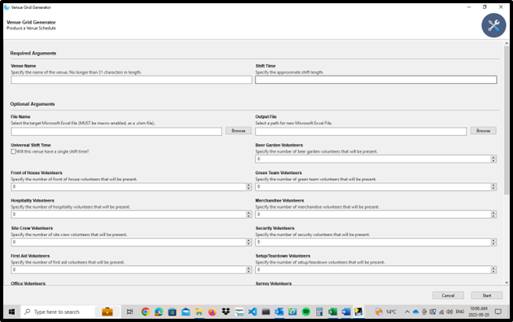
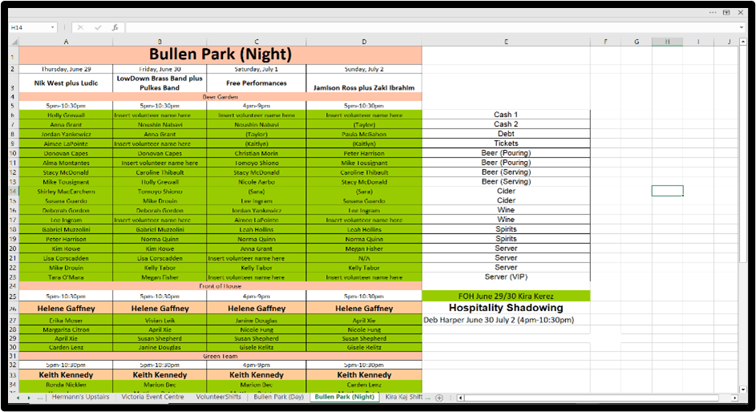

# VolunteerOrganizer (Python Spreadsheet Software for Excel)

## A functional Python-based spreadsheet software application that organizes visual grids and user-inputted data into a target Excel workbook, geared towards event organization utilizing volunteers.

### :toolbox: Languages and Tools

 

This project was done for prior employment for the organization of volunteer shifts for multiple music festival events using Microsoft Excel spreadsheets. With a short script written to modify Excel workbooks and a frontend UI, this application does the following:

* Creates or modifies Excel workbooks of spreadsheets of different show schedules and shift sheets
* Allows users to input data for volunteering positions, show details, and requirements
* Automatically update volunteer shift information for all volunteers or a specific group within the show schedule spreadsheet
* Deliminates supervisor and regular volunteers for an event, each with their own dedicated shift sheet
* Code allows for the addition of new volunteer roles, requirements, and formatting of show schedule spreadsheets

---
## Application Usage Summary

When initializing the program, the UI appears requesting a target Excel workbook, either to create then or a pre-existing given directory path. Then, the user indicates the spreadsheet name and several details regarding an event such as the venue name, approximate time length, what volunteer work areas are required, and other details pertaining to scheduling and supervisor details. Once the form is complete, submit the information and the application will initiate the creation of the new spreadsheet and workbook if applicable.

After successful completion, a new spreadsheet is created within a workbook with cell references to a corresponding volunteer shift spreadsheet for distribution purposes. Thus, you can insert new information for shift times, position names, and venue names to have that information automatically updated for a volunteer with that given shift and vice versa.

This sheet organizes volunteering details of a specific shift for a slotted volunteer. Having all required information for said volunteer in one place. This spreadsheet can then be modified for mail merge and other purposes.
